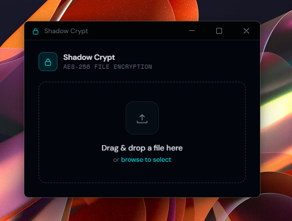
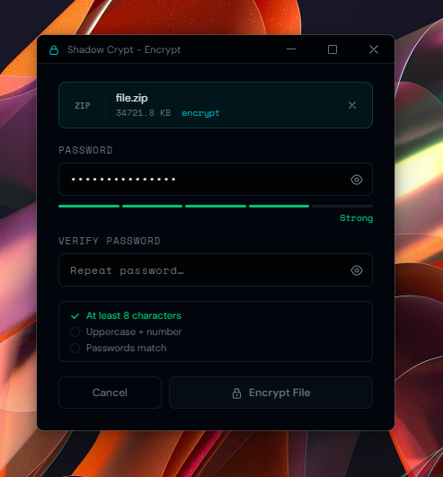

# Shadow Crypt

A free, open-source desktop app for AES-256 file encryption and decryption. Currently optimized for Windows - the core crypto and UI are built on Electron and React, so porting to macOS and Linux is straightforward.




## Why it exists

[AES Crypt](https://www.aescrypt.com) became paywalled, leaving users unable to access their own encrypted `.aes` files without paying. Shadow Crypt was built as a free replacement - it decrypts any `.aes` file created by the original AES Crypt app, and encrypts new files using a significantly stronger format.

## Features

- **Strong encryption** - scrypt key derivation (N=2¹⁷, 64 MB RAM per attempt) + AES-256-GCM authenticated encryption
- **AES Crypt compatibility** - decrypts `.aes` files created by the original AES Crypt app (v2 format)
- **Windows Explorer integration** - right-click any file to open with Shadow Crypt; `.aes` files open with a double-click
- **No overwrite** - output files are never overwritten; duplicates are named automatically
- **No internet connection required** - fully offline, no telemetry, no accounts
- **No admin required** - per-user install

## Encryption format

New encryptions use the Shadow Crypt v2 format (magic: `SCR2`):

| Property | Value |
|---|---|
| KDF | scrypt (N=131072, r=8, p=1) |
| Key size | 256-bit |
| Cipher | AES-256-GCM |
| Authentication | GCM auth tag (built-in) |
| Salt | 16 bytes, random per file |
| IV | 12 bytes, random per file |

For decryption, Shadow Crypt also supports the AES Crypt v2 format (`AES\x02` magic) for backwards compatibility with files created by the original app.

## Building from source

**Requirements:** Node.js 18+, npm

```bash
git clone https://github.com/your-username/shadow-crypt.git
cd shadow-crypt
npm install
```

**Development (hot reload):**
```bash
npm run dev
```

**Production build:**
```bash
npm run build
```

**Windows installer:**
```bash
npm run package
```

The installer is output to `release/Shadow Crypt Setup <version>.exe`.

## Tech stack

- [Electron](https://electronjs.org) 33
- [React](https://react.dev) 18
- [electron-vite](https://electron-vite.org) 2
- [electron-builder](https://www.electron.build) 25
- Node.js built-in `crypto` module - no third-party crypto library

## License

MIT - see [LICENSE](LICENSE).
